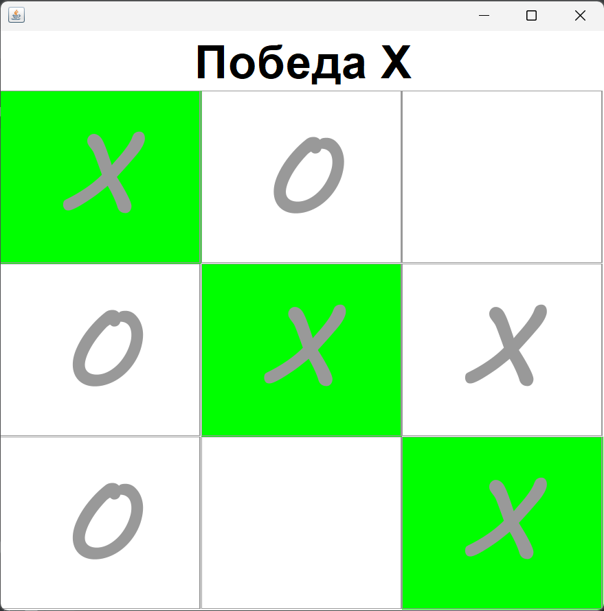
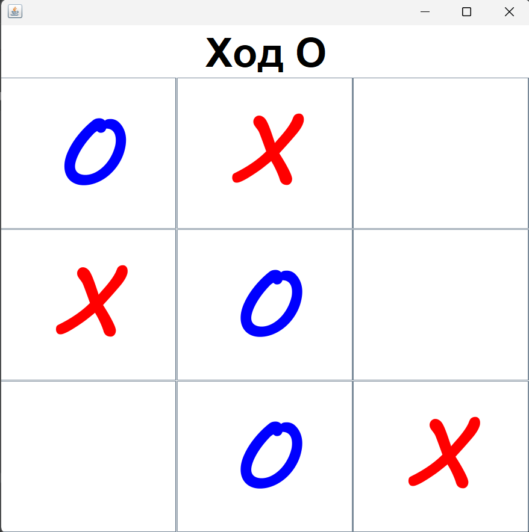

# Крестики-нолики (Tic Tac Toe) в Java

Простая реализация игры "Крестики-нолики" с использованием Java и Swing.

## Описание

Этот проект представляет собой простую игру "Крестики-нолики", где два игрока (X и O) поочередно делают ходы, пытаясь выстроить свои символы в ряд по горизонтали, вертикали или диагонали.

Проект включает в себя графический интерфейс пользователя (GUI), созданный с использованием библиотеки Swing.

---

